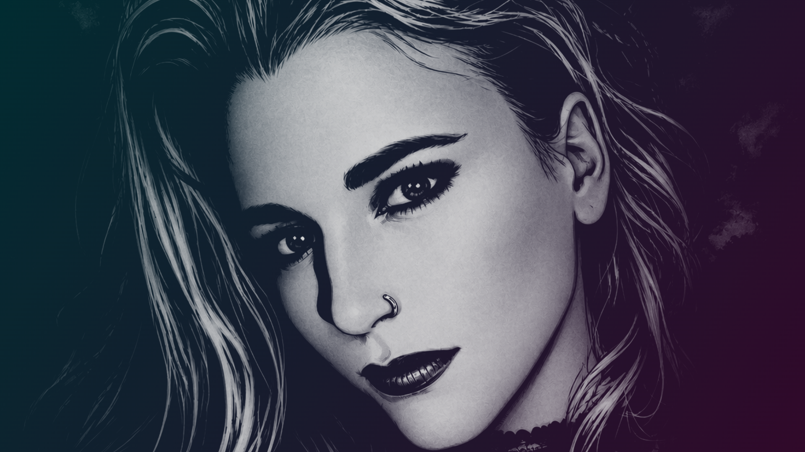
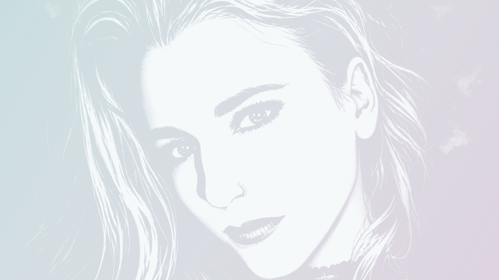
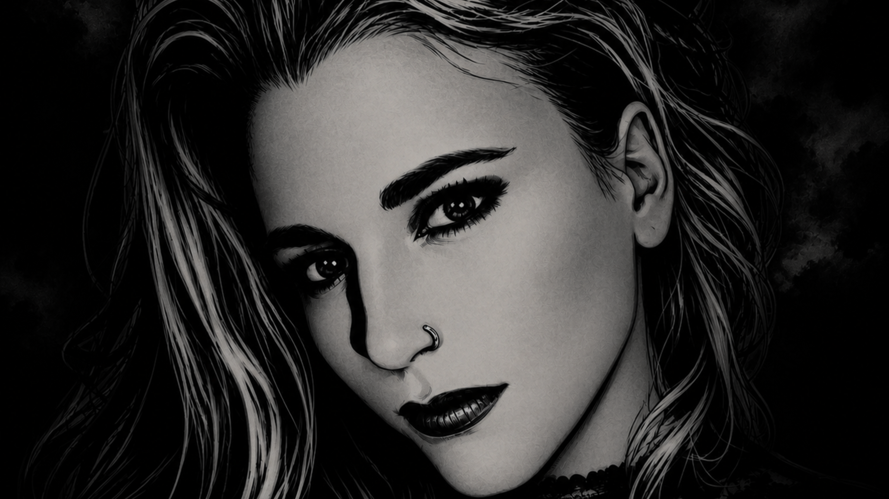
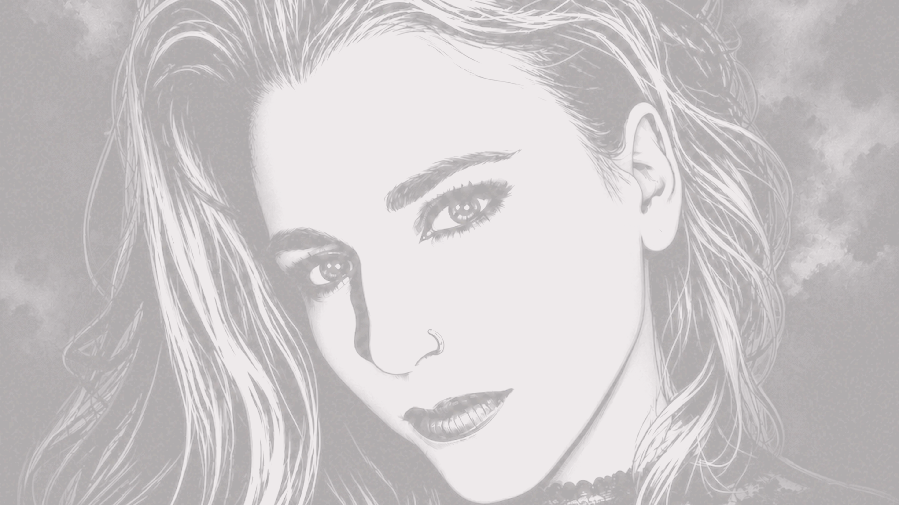
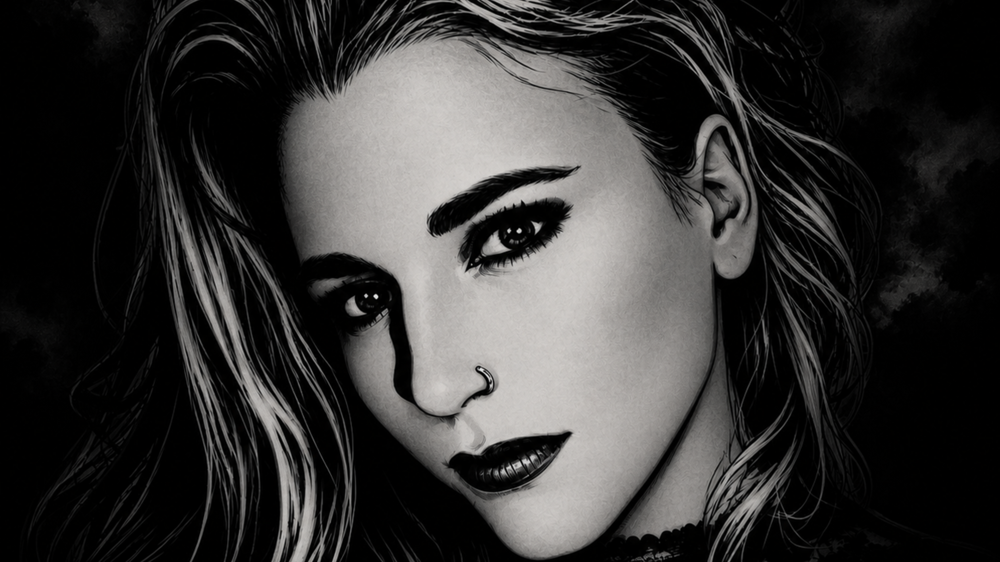
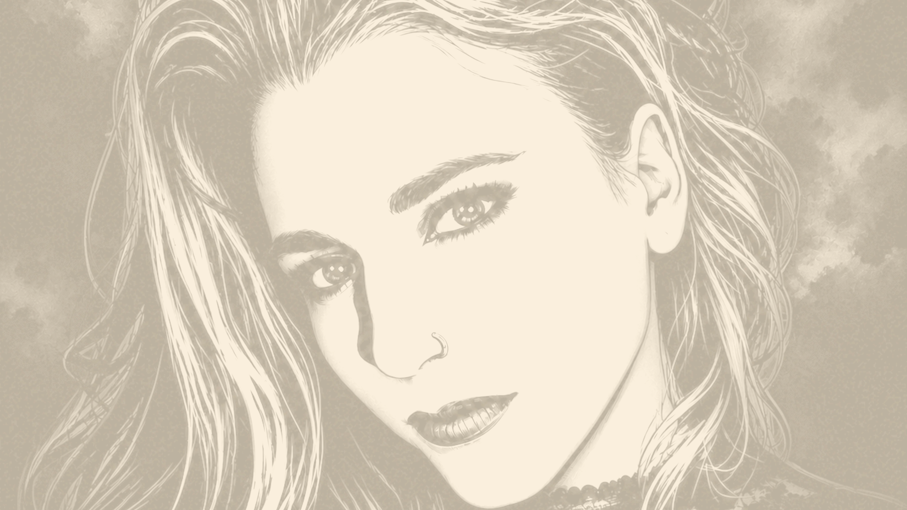

# Neon Mary Theme Family

**Neon Mary** is a family of themes built around the `mary.png` artwork. This repository contains three variants: **Blade Runner**, **The Crow (1994)**, and **Amélie (2001)**. Each variant has dark and light palette modes for terminals, editors, Omarchy, and Hermes Agent.

The canonical artwork is derived from the Mary source. The original square source is preserved as `wallpapers/original-mary-1254.png`; the dark 3840×2160 composition is the Blade Runner variant's current artwork. Light variants use the same composition with a restrained readable grade rather than invented overlays.

## Screenshots gallery

### Example screenshots

The examples below show the family and its current variants. The desktop compositions are designed presentation images rather than live system captures.

### Blade Runner wallpaper variants

| Dark palette | Light palette |
| --- | --- |
|  |  |

The gallery shows the generated 16:9, 16:10, 4:3, 1:1, 9:16, and QHD wallpaper outputs. The live dark Omarchy desktop currently uses the transparent top-bar configuration; the repository includes the supported apply workflow in [`omarchy/apply.sh`](omarchy/apply.sh).


Example 3840×2160 Omarchy desktop presentation for the **Neon Mary: Blade Runner** variant in dark mode, showing its cyan/magenta palette, terminal workspace, theme inspector, and transparent bar treatment.

### The Crow (1994) variant

The Crow variant uses gothic charcoal, ash, mauve, weathered blue, olive, and blood-red accents while preserving the Neon Mary artwork foundation.

| Dark palette | Light palette |
| --- | --- |
|  |  |


Example 3840×2160 Omarchy desktop presentation for the **Neon Mary: The Crow (1994)** variant in dark mode, showing its gothic charcoal, lavender, plum, sage, amber, and crimson palette with terminal workspace, theme inspector, and transparent bar treatment.

### Amélie (2001) variant

The Amélie variant trades neon for a warm Parisian interior: deep café brown, saturated ochre and butter yellow, poppy red, and the film's signature teal-green as the cool counterweight.

| Dark palette | Light palette |
| --- | --- |
|  |  |


Example 3840×2160 Omarchy desktop presentation for the **Neon Mary: Amélie (2001)** variant in dark mode, showing its ochre, butter, olive, teal, and poppy palette with terminal workspace, theme inspector, and transparent bar treatment.

## Variants

### Blade Runner

- `dark`: wet-asphalt black, cyan, magenta, violet, mint, and Blade Runner amber.
- `light`: pale cyan-gray surface with the same neon accents darkened for readable contrast.

### The Crow (1994)

- `dark`: gothic charcoal, ash, mauve, weathered blue, olive, and blood red.
- `light`: pale ash-gray with ink, mauve, olive, and blood-red accents.

### Amélie (2001)

- `dark`: deep café brown with ochre, butter yellow, olive, teal, and poppy red.
- `light`: warm cream surface with the same ochre/poppy/teal accents darkened for readable contrast.

## Included targets

- Native Omarchy packages with `colors.toml`, `icons.theme`, and wallpaper variants.
- Neon Mary: The Crow (1994) and Amélie (2001) Omarchy packages and Hermes skins in dark/light modes.
- Ghostty, iTerm2, Terminal.app, Kitty, Alacritty, WezTerm, Windows Terminal, fzf, tmux, Vim/Neovim, and VS Code resources.
- Hermes Agent skins for CLI/TUI/desktop surfaces.
- Wallpapers: 3840×2160, 2560×1440, 1920×1080, 2560×1600, 2160×1440, 2048×1536, 2048×2048, and 1440×2560 in both modes.
- `generate.py` to reproduce wallpaper variants and generated resources from the palette/source inputs.

## Install

```sh
# Omarchy (copy one package, then apply it)
cp -r omarchy/themes/neon-mary-dark ~/.config/omarchy/themes/
omarchy-theme-set neon-mary-dark
# Optional shell preference: keep the top menubar transparent
omarchy bar transparent true

# The Crow (1994) variant — applies the dark version and transparent bar
./omarchy/apply-crow.sh dark

# Amélie (2001) variant — applies the dark version and transparent bar
./omarchy/apply-amelie.sh dark

# Hermes Agent (active profile home; do not copy secrets)
mkdir -p "${HERMES_HOME:-$HOME/.hermes}/skins"
cp hermes/skins/neon-mary-dark.yaml "${HERMES_HOME:-$HOME/.hermes}/skins/"
hermes config set display.skin neon-mary-dark
```

Terminal files are portable exports; install them using each application's normal theme/import mechanism. iTerm2 and Terminal.app resources are intentionally kept as inspectable exports rather than modifying macOS preferences automatically.

## Rebuild and validate

```sh
python3 generate.py
python3 validate.py

# Contrast + YAML audit across every Hermes skin in the repo
python3 validate_contrast.py

# Re-render the showcase screenshots (embeds each wallpaper as a data URI)
python3 render_screenshots.py
```

The Blade Runner generator uses the canonical current artwork from `~/Wallpapers/blade-runner-neon-mary-4k.png`; `generate_crow.py` derives the Crow (1994) variant and `generate_amelie.py` the Amélie (2001) variant from `~/Pictures/mary.png`. No source secrets or machine-local configuration are included.

## License

Theme code and configuration: MIT. Artwork provenance and redistribution rights remain with the original artwork owner; this repository preserves the supplied local source and should only be published where you have the right to share it.
