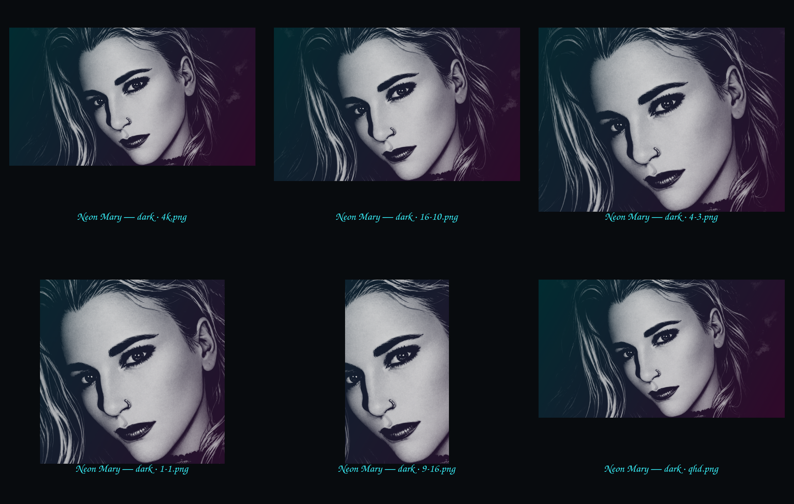
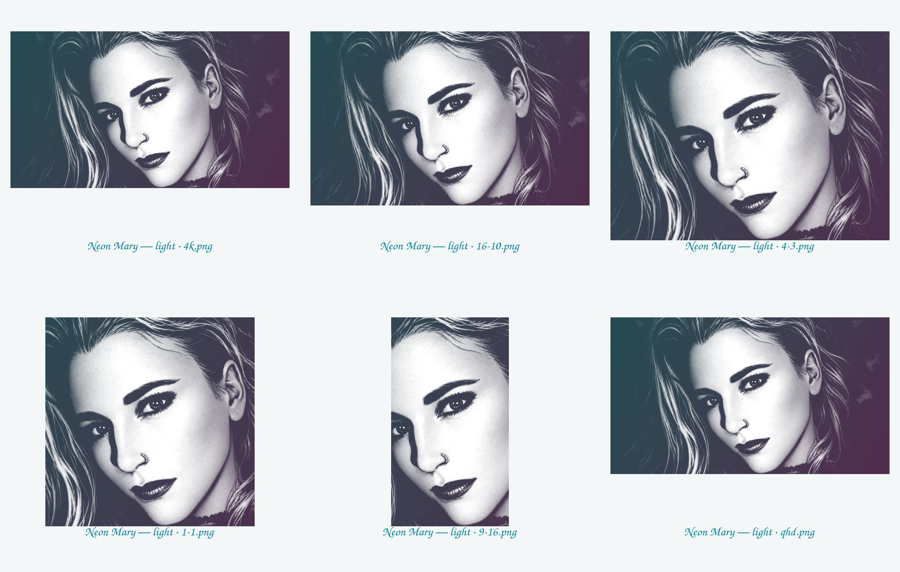
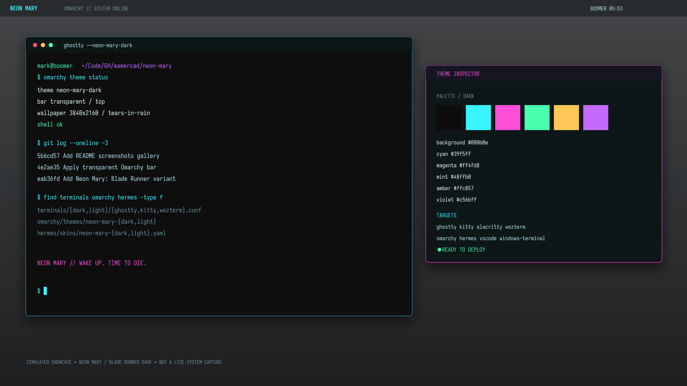

# Neon Mary: Blade Runner

**Neon Mary** is a family of themes built around the `mary.png` artwork. This repository contains the **Blade Runner** variant, with dark and light palette modes, for terminals, editors, Omarchy, and Hermes Agent.

The canonical artwork is derived from the Mary source. The original square source is preserved as `wallpapers/original-mary-1254.png`; the dark 3840×2160 composition is the Blade Runner variant's current artwork. Light variants use the same composition with a restrained readable grade rather than invented overlays.

## Screenshots gallery

### Blade Runner wallpaper variants

| Dark palette | Light palette |
| --- | --- |
|  |  |

The gallery shows the generated 16:9, 16:10, 4:3, 1:1, 9:16, and QHD wallpaper outputs. The live dark Omarchy desktop currently uses the transparent top-bar configuration; the repository includes the supported apply workflow in [`omarchy/apply.sh`](omarchy/apply.sh).

### Simulated Omarchy showcase



Designed showcase composition for the active 3840×2160 Omarchy configuration: Neon Mary / Blade Runner dark palette, cyan/magenta accents, terminal workspace, theme inspector, and transparent bar treatment. This is a simulated presentation image, not a live desktop capture.

## Blade Runner variant modes

- `dark`: wet-asphalt black, cyan, magenta, violet, mint, and Blade Runner amber.
- `light`: pale cyan-gray surface with the same neon accents darkened for readable contrast.

## Included targets

- Native Omarchy packages with `colors.toml`, `icons.theme`, and wallpaper variants.
- Ghostty, iTerm2, Terminal.app, Kitty, Alacritty, WezTerm, Windows Terminal, fzf, tmux, Vim/Neovim, and VS Code resources.
- Hermes Agent skins for CLI/TUI/desktop surfaces.
- Wallpapers: 3840×2160, 2560×1440, 1920×1080, 2560×1600, 2160×1440, 2048×1536, 2048×2048, and 1440×2560 in both modes.
- `generate.py` to reproduce wallpaper variants and generated resources from the palette/source inputs.

## Install

```sh
# Omarchy (copy one package, then apply it)
cp -r omarchy/themes/neon-mary-dark ~/.config/omarchy/themes/
omarchy-theme-set neon-mary-dark
# Optional shell preference: keep the top menubar transparent
omarchy bar transparent true

# Hermes Agent (active profile home; do not copy secrets)
mkdir -p "${HERMES_HOME:-$HOME/.hermes}/skins"
cp hermes/skins/neon-mary-dark.yaml "${HERMES_HOME:-$HOME/.hermes}/skins/"
hermes config set display.skin neon-mary-dark
```

Terminal files are portable exports; install them using each application's normal theme/import mechanism. iTerm2 and Terminal.app resources are intentionally kept as inspectable exports rather than modifying macOS preferences automatically.

## Rebuild and validate

```sh
python3 generate.py
python3 validate.py
```

The generator uses ImageMagick and reads the canonical current artwork from `~/Wallpapers/blade-runner-neon-mary-4k.png` plus the original from `~/Pictures/mary.png`. No source secrets or machine-local configuration are included.

## License

Theme code and configuration: MIT. Artwork provenance and redistribution rights remain with the original artwork owner; this repository preserves the supplied local source and should only be published where you have the right to share it.
